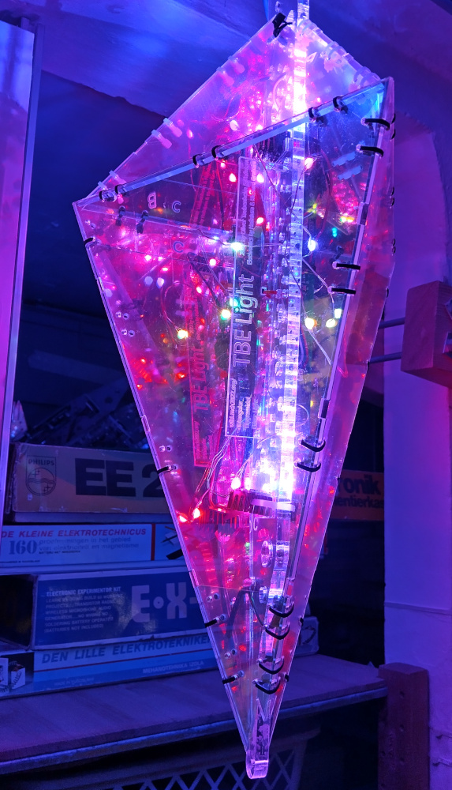

# TBE light
These are the source files for TBE lights shown at MCH2022. Original wiki page can be found here: [wiki.mch2022.org](https://wiki.mch2022.org/TBE_light)

## Credits
This project was funded by the [IFCAT foundation](https://ifcat.org/) for the technology festival [MCH2022](https://mch2022.org/).

Main contributors where:
- [Hafnium](https://github.com/hafpaf/): holding everything together
- [Oliver Taubenheim](https://www.facebook.com/a2kOliverTbm): CAD modelling
- [Richard Graham](https://github.com/Richard42Graham): PCB design

A big thanks to all contributors that helped during the prototyping of this project.

## Details

The LED controller uses an ESP32 with an LAN8720A chip for Ethernet connection and is compatible with [WLED](https://github.com/Aircoookie/WLED).

The repository is split into two categories
- [PCB](./PCB/): contains Gerber files for LED controller board, as well as an component list.
-  [CAD](./CAD/): contains to Adobe Illustrator files that can be opened in [Lightburn](https://lightburnsoftware.com/) or similar laser cutting software.

